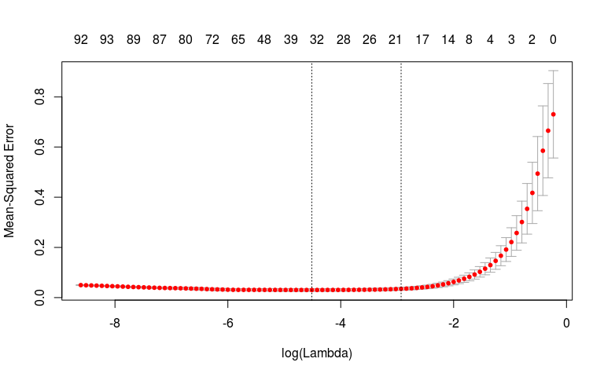
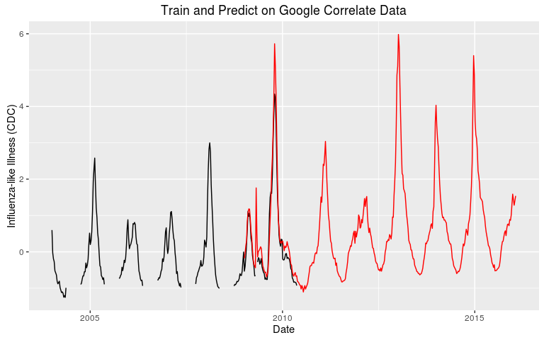
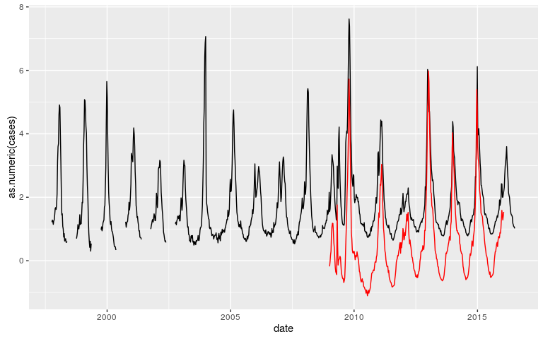

# trends
daniel  
July 19, 2016  


```r
# set some stuff up
rm(list = ls())
if (interactive()) {
    data <- "sismid_10-statistics_and_modeling_with_novel_data_streams/trends/correlate-Influenza_like_Illness_CDC_.csv"
    cdc_data <- "sismid_10-statistics_and_modeling_with_novel_data_streams/trends/CDC_national_updated.csv"
} else {
    data <- "correlate-Influenza_like_Illness_CDC_.csv"
    cdc_data <- 'CDC_national_updated.csv'
}
```


```r
library(readr)
library(lubridate)
library(dplyr)
library(glmnet)
library(useful)

ili <- read_csv(data, comment = "#", skip = 1)

 # there are 2 empty lines at the end of the file
non_empty <- apply(X = ili,
             MARGIN = 1,
             FUN = function(x){
                 ifelse(all(is.na(x)), FALSE, TRUE)
                 })
ili <- ili[non_empty, ]
ili_2 <- read.csv(data, comment.char = '#', stringsAsFactors = FALSE)
identical(ili$Date, ili_2$Date)
```

```
## [1] FALSE
```


```r
useful::topleft(ili)
```

<!-- <div class="kable-table"> -->

Date          Influenza-like Illness (CDC)   influenza type a   symptoms of flu   flu duration
-----------  -----------------------------  -----------------  ----------------  -------------
2004-01-04                           0.599              1.653             0.112          1.566
2004-01-11                          -0.024              0.299            -0.012          0.463
2004-01-18                          -0.192             -0.078            -0.218          0.009
2004-01-25                          -0.268             -0.631            -0.342         -0.766
2004-02-01                          -0.522             -0.161            -0.523         -0.089

</div>

```r
useful::topleft(ili_2)
```

<!-- <div class="kable-table"> -->

Date          Influenza.like.Illness..CDC.   influenza.type.a   symptoms.of.flu   flu.duration
-----------  -----------------------------  -----------------  ----------------  -------------
2004-01-04                           0.599              1.653             0.112          1.566
2004-01-11                          -0.024              0.299            -0.012          0.463
2004-01-18                          -0.192             -0.078            -0.218          0.009
2004-01-25                          -0.268             -0.631            -0.342         -0.766
2004-02-01                          -0.522             -0.161            -0.523         -0.089

</div>

# Google Coorelate

Define training period on data.
Use to predict on an out of sample testset.


```r
table(year(ili$Date), useNA = 'always')
```

```
## 
## 2004 2005 2006 2007 2008 2009 2010 2011 2012 2013 2014 2015 2016 <NA> 
##   52   52   53   52   52   52   52   52   53   52   52   52    4    0
```


```r
training_years <- c(2004:2008)
testing_years <- c(2009:2016)
```


```r
train_years <- ili[year(ili$Date) %in% training_years , "Date"]
test_years <- ili[year(ili$Date) %in% testing_years , "Date"]
```


```r
gc_training <- ili %>%
    filter(year(Date) %in% training_years) %>%
    select(-Date)
names(gc_training) <- sprintf('v%s', 1:ncol(gc_training))
gc_training <- gc_training %>% as.matrix()
topleft(gc_training)
```

```
##          v1     v2     v3     v4     v5
## [1,]  0.599  1.653  0.112  1.566  0.176
## [2,] -0.024  0.299 -0.012  0.463 -0.216
## [3,] -0.192 -0.078 -0.218  0.009 -0.284
## [4,] -0.268 -0.631 -0.342 -0.766 -0.451
## [5,] -0.522 -0.161 -0.523 -0.089 -0.551
```


```r
gc_testing <- ili %>%
    filter(year(Date) %in% testing_years) %>%
    select(-Date)
names(gc_testing) <- sprintf('v%s', 1:ncol(gc_testing))
gc_testing <- gc_testing %>% as.matrix()
topleft(gc_testing)
```

```
##          v1     v2     v3    v4     v5
## [1,] -0.532 -0.296 -0.128 0.208 -0.082
## [2,] -0.400 -0.195 -0.207 0.197 -0.101
## [3,] -0.134  0.066 -0.174 0.093  0.010
## [4,]  0.225  0.404  0.063 0.253  0.216
## [5,]  0.634  0.960  0.195 0.738  0.321
```

## Fit the model


```r
x <- build.x(v1 ~ . - 1, gc_training, FALSE)
y <- build.y(v1 ~ . - 1, gc_training)
```


```r
# set the seed
set.seed(42)

# LASSO with 5 fold cross-validation
mod_cv5 <- cv.glmnet(x = x, y = y, family = "gaussian", nfold = 5)
predictions_cv5 <- predict(mod_cv5, gc_testing[, -1])
```

## Look at model coefficients


```r
mod_cv5$lambda.min
```

```
## [1] 0.01097739
```

```r
mod_cv5$lambda.1se
```

```
## [1] 0.05337867
```

```r
plot(mod_cv5)
```

<!-- -->


```r
#coef(mod_cv5, s="lambda.1se")
```


```r
# plot the path
plot(mod_cv5$glmnet.fit, xvar = "lambda")

# add in vertical lines for the optimal values of lambda
abline(v = log(c(mod_cv5$lambda.min, mod_cv5$lambda.1se)), lty = 2)
```

<!-- -->

## Plot predictions


```r
ggplot() +
    geom_line(data = ili, aes(x = Date, y = `Influenza-like Illness (CDC)`)) +
    geom_line(aes(x = test_years, y = as.numeric(predictions_cv5)), color = 'red') +
    ggtitle('Train and Predict on Google Correlate Data')
```

<!-- -->

# CDC Data


```r
cdc <- read_csv(cdc_data)
cdc$date <- as.Date(paste(cdc$YEAR, cdc$WEEK, 1, sep = '-'), "%Y-%U-%u")
names(cdc) <- c('year', 'week', 'cases', 'date')
head(cdc)
```

<!-- <div class="kable-table"> -->

 year   week  cases     date       
-----  -----  --------  -----------
 1997     40  1.21686   1997-10-06 
 1997     41  1.28064   1997-10-13 
 1997     42  1.23906   1997-10-20 
 1997     43  1.14473   1997-10-27 
 1997     44  1.26112   1997-11-03 
 1997     45  1.28275   1997-11-10 

</div>


```r
ggplot() +
    geom_line(data = cdc, aes(x = date, y = as.numeric(cases))) +
    geom_line(aes(x = test_years, y = predictions_cv5), color = 'red')
```

<!-- -->
